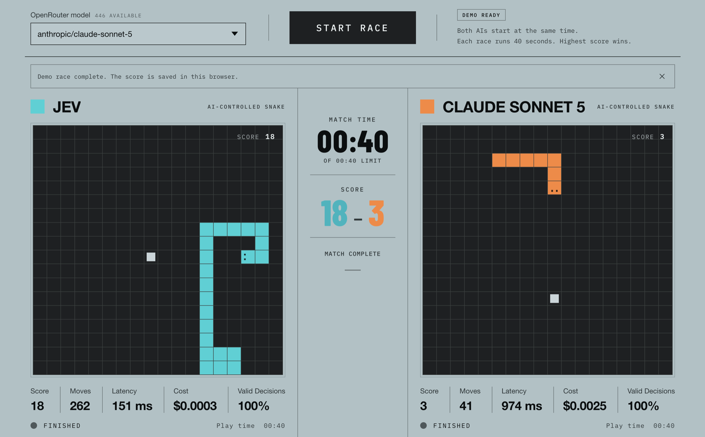

# SnakeBench

A head-to-head Snake benchmark that races [Jev](https://typesafe.ai/blog/introducing-system-one-models-and-jev)
against a current frontier LLM from OpenRouter. Both agents get the same board
seed and the same 40-second wall-clock budget, so the score gap reflects how
many good decisions each model can make per second.

**Live app:** <https://jev-snake-game.vercel.app>



Everything runs in the browser. There is no application backend, and your API
keys never leave the machine.

## How a race works

- One 18×18 board, one seed per race. Both snakes start from the same position
  and see the same food sequence, so the only variable is the agent.
- Each move is a separate API call. The board is serialized to JSON — snake
  segments, food, current direction, legal moves — and the agent answers with
  one of `up`, `right`, `down`, `left`.
- An illegal or unparseable answer does not end the race. The board keeps the
  current heading if it is still legal, otherwise it takes the first legal move,
  and the move is counted against **Valid Decisions**.
- The clock stops at 40 seconds. Highest score wins; a crash ends that snake's
  run early.

Each side reports five numbers: **Score**, **Moves**, average **Latency**,
**Cost**, and the share of **Valid Decisions**. Because every move costs a round
trip, latency is the benchmark — a model that answers in a second gets roughly
40 moves, while a faster one gets hundreds.

## Run it locally

Requires Node 20 or newer.

```bash
npm install
npm run dev
```

Vite prints a local URL, normally <http://localhost:5173>. Open it and press
**Start race**.

### Demo mode and live mode

Without API keys the app runs in **demo mode**, which simulates both agents
locally so you can see the layout and the scoring work. The screenshot above is
a demo race.

For a real race, open **Settings**, paste a Jev key and an OpenRouter key, and
save. Both keys are stored in this browser's `localStorage`, unencrypted, and
are sent only to `api.typesafe.ai` and `openrouter.ai`.

A live race costs real money — one chat completion per move — though a 40-second
race is typically fractions of a cent.

Completed match scores are also kept in `localStorage` and are listed under
**Recent matches** in the Settings dialog.

## Picking an opponent

The model dropdown pins the current frontier model from each major lab under
**Latest models** and lists the rest of the OpenRouter catalog below. The
shortlist lives in `FRONTIER_MODELS` in `src/api.js`. Pricing there is a
fallback; whenever the live OpenRouter catalog loads, its prices win.

## Language

The topbar switcher toggles the interface between English and Japanese. On a
first visit the app follows the browser's language; after that it remembers the
choice in `localStorage`. All UI copy lives in `src/i18n.js` as two flat
dictionaries — add a key to `en` and the matching key to `ja`, and English
backstops anything a translation is missing.

## Project layout

| Path | What it holds |
| --- | --- |
| `src/App.jsx` | The whole UI: controls, boards, scoreboard, settings dialog |
| `src/game.js` | Board rules, seeded food placement, and the demo-mode agent |
| `src/api.js` | TypeSafe and OpenRouter clients, plus the frontier model list |
| `src/i18n.js` | English and Japanese dictionaries |
| `worker/index.js` | SPA-fallback worker used by the Sites handoff |
| `scripts/prepare-sites-build.mjs` | Packages `dist/` for Sites after the Vite build |

## Commands

| Command | What it does |
| --- | --- |
| `npm run dev` | Vite dev server with hot reload |
| `npm run build` | Production build into `dist/`, then the Sites packaging step |
| `npm run preview` | Serve the production build |
| `npm run test:sites` | Check the Sites worker and its build artifacts |

## Deploying

`vercel.json` builds with `npm run build`, serves `dist/client`, and rewrites
every path to `index.html`. The same build also emits `dist/server/index.js` and
`dist/.openai/hosting.json` so the project can be handed to Sites unchanged —
run `npm run build && npm run test:sites` before that handoff.

## Known limits

TypeSafe currently rejects requests from arbitrary browser origins, so a live
Jev race needs this app's origin on their CORS allowlist. Demo mode works
regardless.
